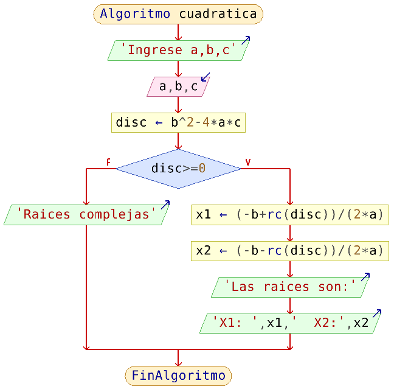
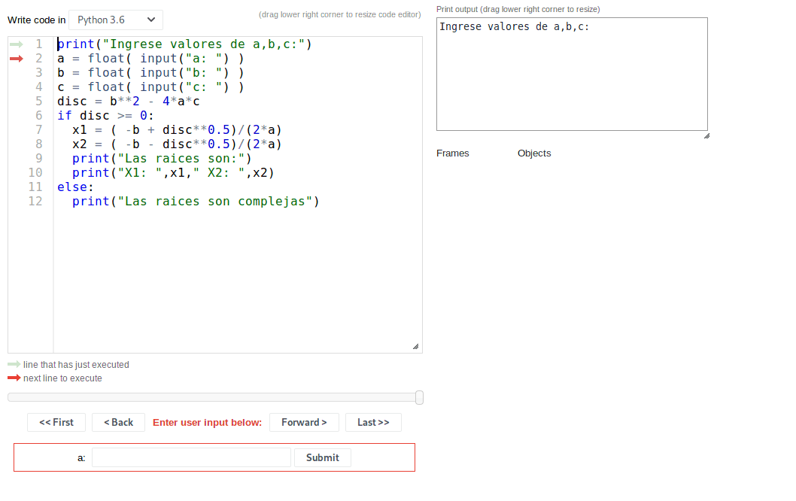
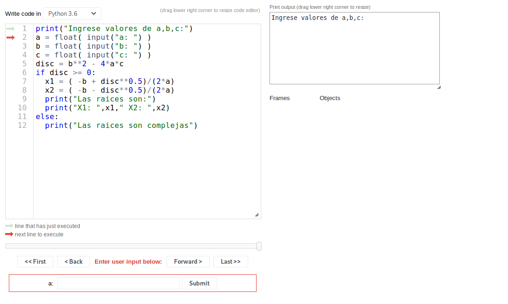

# Condicionales

Hasta el momento se ha visto dos ordenes importantes en algoritmia: La entrada y salida de datos. Por medio de estas dos ordenes es que se puede establecer una interacción entre el usuario y el computador: a través de la salida de mensajes por el monitor, el algoritmo/programa le muestra información al usuario, y por medio del teclado se habilita éste a que ingrese información al computador; estos datos ingresados pueden ser usados para efectuar cualquier proceso que el algoritmo requiera. De forma general, estas acciones resumen de una manera muy clara las partes de un algoritmo: entradas, proceso, salida, que se encuentran en cualquier algoritmo

La forma y complejidad de un algoritmo esta muy relacionada con el problema que se este resolviendo, lo cual se reflejado directamente en el proceso del algoritmo. Como se estan escribiendo algoritmos computacionales, cabe recordar que el computador, a pesar de ser una herramienta que hace cálculos muy rápido, es un dispositivo que no tiene capacidad de inferir y de tomar decisiones. Esto es, el computador no sabe que hacer por si solo sino que el programador se tiene que encargar de escribir de forma detallada que es lo que éste debe hacer. 

Una de las capacidades que tiene el ser humano es de tomar decisiones dependiendo de las condiciones a las que esté sometido. Por ejemplo, si se va a tomar una pastilla de forma regular, sabe que se la debe tomar en la hora indicada, no antes o después. Esto significa que  debe evaluar si la hora del dia en la que se encuentra corresponde o no a la hora indicada para decidir si se toma o no la pastilla. Este tipo de acciones son cosas que ya resultan naturales para uno. La pregunta que surge es: si en la vida real hay situaciones donde se debe tomar decisiones, y se necesita escribir un algoritmo para ésto, ¿ como se puede establecer la toma de decisiones dentro de un algoritmo y por ende en un programa?

Existe un tipo de estructura conocida como **estructuras de control** que permite tomar decisiones dentro de un algoritmo, dependiendo de si se satisface o no una condición. Estas estructuras son conocidas como **condicionales.**

## Sintaxis de un condicional

La forma de escribir un condicional en forma de seudocódigo \(y en un programa\) puede variar acorde al número de condiciones que se tenga. A continuación se muestra las distintas formas de escribir un condicional

### SI

Se usa la estructura **SI-HAGA**  que consta de una condición y una sentencia. Dicha sentencia se ejecuta si la condición es verdadera; en caso contrario, el algoritmo prosigue con las sentencias que esten por debajo del concional.


### SI - SINO

Esta estructura consta de una condición y dos sentencias: la primera sentencia se ejecuta si la condicion es verdadera, y la segunda en caso de que la condición sea falsa.


### SI - SINO SI - SINO

Esta estructura es muy útil cuando lo que se quiere evaluar es un conjunto de condiciones. Si la condición 1 no se cumple, se evalúa la condición 2; en caso de que la condición 2 sea verdadera, se ejecuta la sentencia 2 y se termina la estructura. Es importante resaltar que en esta estructura se evalúan las condiciones hasta que se encuentra una que cumpla, esto es, si se tienen $$N$$ condiciones y se cumple la condición $$i$$ \(con  $$i < N$$\) , no se sigue evaluando las siguientes $$N-i$$ condiciones restantes. En caso de que ninguna condici**ó**n se cumpla, se ejecuta la sentencia que está en el **sino.**


### Condicionales anidados

Cuando se tiene un condicional y la condición es verdadera, se ejecuta su sentencia asociada. Esta sentencia en realidad es un bloque de algoritmo que puede contener todo lo que se pueda escribir en un algoritmo. En el caso particular en el que dentro de la sentencia de un condicional hay otro condicional, se le conoce como condicionales anidados


En la ilustración se muestra un ejemplo de condicionales anidados, pero no significa que sea la única forma. Se entiende por anidado cuando una estructura esta contenida dentro de otra.

## Sintaxis de un condicional en python

A medida que se profundice en la sintaxis de python, se notará que la mayoria de los comandos de python son palabras en ingles o abreviaciones de estas. Esto también es comun en la mayoria de los lenguajes, por lo que los comandos serian practicamente universales. Lo unico que podria variar entre lenguajes es la sintaxis particular.

En python, para escribir un condicional se hace de la siguiente forma:


```python
if condicion:
    sentencia

```



```python
if condicion:
    sentencias 1
else:
    sentencias 2
```



```python
if condicion 1:
    sentencias 1
elif condicion 2:
    sentencias 2
elif condicion 3:
    sentencias 3
    .
    .
    .
elif condicion i:
    sentencias i
    .
    .
    .
elif condicion N:
    sentencias N
else:
    sentencias
    

```


Para establecer las condiciones es necesario hacer uso de los operadores relacionales:

## Operadores en python

Debido a que los procesos necesitan cada vez operaciones mas elaboradas, es necesario especificar cuales son los operadores que se pueden usar en python.

### Operadores matemáticos

| Operador | Ejemplo | Descripción |
| :--- | :--- | :--- |
| + | `a + b` | Suma |
| - | `a - b` | Resta |
| \* | `a * b` | Multiplicación |
| / | `a / b` | División |
| // | `a // b` | División entera \(el resultado de la división es el numero entero menor mas cercano\) |
| % | `a % b` | Residuo: Da el residuo de la división de dos números |
| \*\* | `a ** b` | Potencia o exponenciación: eleva un numero `a` a la potencia `b` |

### Operadores relacionales o de comparación

| Operador | Ejemplo | Descripción |
| :--- | :--- | :--- |
| &gt; | `a > b` | Mayor |
| &lt; | `a < b` | Menor |
| &gt;= | `a >= b` | Mayor igual \( $$\geqslant$$ \) |
| &lt;= | `a <= b` | Menor igual \( $$\leqslant$$ \) |
| == | `a == b` | Igual |
| != | `a != b` | Diferente \( $$\neq$$ \) |

### Operadores lógicos

| Operador | Ejemplo | Descripcion |
| :--- | :--- | :--- |
| and | `a and b` | Disyunción logica |
| or | `a or b` | Conjunción lógica |
| not | `not a` | Negación lógica |

Si quiere profundizar sobre operadores y variables, puede consultar la página de [RealPython](https://realpython.com/python-operators-expressions/)

Note también que no se han incluido otras funciones matemáticas, ya que para esto es necesario importar librerias matemáticas.

## Ejemplo 1

> Dada la ecuación $$ax^2 + bx + c = 0$$ , encontrar las raíces de la ecuación.

#### Solución:

Este es un ejercicio muy comun porque muestra el uso básico de los condicionales. La solución a este problema se puede hacer lo mas robusta o sofisticada que se quiera, sin embargo, en este caso solo se va a verificar que las raices sean reales o no. Esto significa que si las raices son reales, se va a mostrar la solución en pantalla, sino solo se mostrará un aviso de que las raices son complejas

Se procede a seguir los pasos establecidos al inicio para resolver cualquier problema

**1\) Entradas, proceso y salida**

```text
Entradas:
    - Coeficientes de la ecuacion: a, b y c
Proceso:
    * discriminante = b² - 4*a*c
    * x1 = ( -b + raiz(discriminante))/(2*a)
    * x2 = ( -b - raiz(discriminante))/(2*a)
Salidas:
    - Raices: x1 y x2

```

**2\) Definición de variables**

| **Nombre** | Tipo de dato |
| :--- | :--- |
| a | Real \(numérico\) |
| b | Real \(numérico\) |
| c | Real \(numérico\) |
| disc | Real \(numérico\) |
| x1 | Real \(numérico\) |
| x2 | Real \(numérico\) |

**3\) Diagrama de flujo**



**4\) Pseudocódigo**



**1\) Inicio  
2\) Muestre "**Ingrese valores de a,b,c**"  
3\) Entre** a,b,c  
**4\)** disc = b^2-4\*a\*c  
**5\) Si** disc &gt;= 0 **haga  
6\)**      x1 = \( -b + rc\(disc\) \)/\(2\*a\)  
**7\)**      x1 = \( -b -  rc\(disc\) \)/\(2\*a\)  
**8\)      Muestre "**Las raices son:**"  
9\)      Muestre "**X1: **",x1, "**  X2:  **",x2  
10\) Sino  
11\)    Muestre "**Las raíces son complejas**"**







**5\) Programa en python**


```python
print("Ingrese valores de a,b,c:")
a = float( input("a: ") )
b = float( input("b: ") )
c = float( input("c: ") )
disc = b**2 - 4*a*c
if disc >= 0:
  x1 = ( -b + disc**0.5)/(2*a)
  x2 = ( -b - disc**0.5)/(2*a)
  print("Las raices son:")
  print("X1: ",x1," X2: ",x2)
else:
  print("Las raices son complejas")
```


Ejecutando el programa con valores que dan raíces reales,se obtiene:


Y para el caso de raices complejas:


Para ver en mas detalle el proceso interno en el algoritmo, se muestra la siguiente animación:

**Caso 1: raices reales**



Se puede acceder al demo al siguiente [Link permanente](http://pythontutor.com/live.html#code=print%28%22Ingrese%20valores%20de%20a,b,c%3A%22%29%0Aa%20%3D%20float%28%20input%28%22a%3A%20%22%29%20%29%0Ab%20%3D%20float%28%20input%28%22b%3A%20%22%29%20%29%0Ac%20%3D%20float%28%20input%28%22c%3A%20%22%29%20%29%0Adisc%20%3D%20b**2%20-%204*a*c%0Aif%20disc%20%3E%3D%200%3A%0A%20%20x1%20%3D%20%28%20-b%20%2B%20disc**0.5%29/%282*a%29%0A%20%20x2%20%3D%20%28%20-b%20-%20disc**0.5%29/%282*a%29%0A%20%20print%28%22Las%20raices%20son%3A%22%29%0A%20%20print%28%22X1%3A%20%22,x1,%22%20X2%3A%20%22,x2%29%0Aelse%3A%0A%20%20print%28%22Las%20raices%20son%20complejas%22%29&cumulative=false&curInstr=0&heapPrimitives=nevernest&mode=display&origin=opt-live.js&py=3&rawInputLstJSON=%5B%221%22,%222%22,%221%22%5D&textReferences=false)

**Caso 2: raíces complejas**



Se puede acceder al demo al siguiente [link permanente](http://pythontutor.com/live.html#code=print%28%22Ingrese%20valores%20de%20a,b,c%3A%22%29%0Aa%20%3D%20float%28%20input%28%22a%3A%20%22%29%20%29%0Ab%20%3D%20float%28%20input%28%22b%3A%20%22%29%20%29%0Ac%20%3D%20float%28%20input%28%22c%3A%20%22%29%20%29%0Adisc%20%3D%20b**2%20-%204*a*c%0Aif%20disc%20%3E%3D%200%3A%0A%20%20x1%20%3D%20%28%20-b%20%2B%20disc**0.5%29/%282*a%29%0A%20%20x2%20%3D%20%28%20-b%20-%20disc**0.5%29/%282*a%29%0A%20%20print%28%22Las%20raices%20son%3A%22%29%0A%20%20print%28%22X1%3A%20%22,x1,%22%20X2%3A%20%22,x2%29%0Aelse%3A%0A%20%20print%28%22Las%20raices%20son%20complejas%22%29&cumulative=false&curInstr=7&heapPrimitives=nevernest&mode=display&origin=opt-live.js&py=3&rawInputLstJSON=%5B%224%22,%223%22,%222%22%5D&textReferences=false)

Nótese que en este caso se uso la función potencia para calcular la raiz cuadrada, ya que esta función no esta por defecto implementada en python. Si se quisiera usar funciones matemáticas, toca importar librerías en python. Para esto vamos a usar la forma 1 o 2 que se menciona en la [unidad de importe de librerías de python](../python-basico/importando-librerias.md).

Usando la forma 1 de importe de librerias, el programa quedaria asi:

```python
# Importando libreria math
import math 

print("Ingrese valores de a,b,c:")
a = float( input("a: ") )
b = float( input("b: ") )
c = float( input("c: ") )

disc = b**2 - 4*a*c

if disc >= 0:
  x1 = ( -b + math.sqrt(disc) )/(2*a)
  x2 = ( -b - math.sqrt(disc) )/(2*a)
  print("Las raices son:")
  print("X1: ",x1," X2: ",x2)
else:
  print("Las raices son complejas")
```

## Ejercicio


El problema de encontrar las raíces de la ecuación cuadrática se resolvió considerando solo la condición del determinante. Resuelva el mismo problema pero teniendo en cuenta las siguientes consideraciones:

* Que pasa si el valor de a=0?
* Que pasa si a=b y b=0?
* Que pasa si a=0 y b=0 y c=0?
* Que pasa si se quieren considerar las raices complejas?

Escriba un algoritmo que calcule los valores de las raices, teniendo en cuenta estas consideraciones. Este proceso se conoce como validación de los valores o entradas.

¿Cómo se podria hacer en python para verificar si los valores que ingreso el usuario son números o letras?


