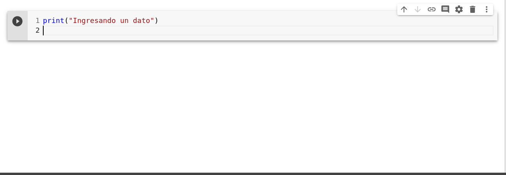

# Entrada y salida de datos

Uno de los aspectos mas importantes de un algoritmo son las entradas y las salidas, puesto que de esa forma se define que es lo que se quiere y que es lo que se necesita. Cabe aclarar que para poder definir ambos requerimientos, es necesario comprender el problema que se vaya a resolver; hay algunos casos donde la definición de las entradas se logra establecer una vez se haga un bosquejo de como resolver el problema, pero nuevamente, esto requiere comprender de forma general el problema.

Como se mencionó en la parte final de las [generalidades](algoritmia.md#representacion-de-algoritmos), para resolver un problema se seguirán un conjunto de pasos, que inicialmente parece redundante, pero que con el fin de garantizar la mayor retención y comprensión, se realizaran. Una vez se vaya adquiriendo experiencia, se podra implementar sólo algunos de ellos.

Para ver el uso de entradas y salidas, estudiemos el siguiente problema:

\*\*\*\*

### **Problema 1**

> Dada la temperatura de un objeto en Celsius, convertir dicho valor a Kelvin y Fahrenheit.

**Solucion:**

Para resolver este problema se seguirán los pasos 2 a 5

#### **2\) Entradas, Proceso  y Salidas**

```text
Entradas:
    - Temperatura en Celsius
Proceso:
    - T[°F] = (5/9)T[°C] + 32
    - T[K] = T[°C] + 273.15
Salidas:
    - Temperatura equivalente en Kelvin
    - Tempreatura equivalente en Fahrenheit
```

Se puede ver que el proceso en este caso solo consta de las ecuaciones de conversión de Celsius a Kelvin y Fahrenheit.

#### **3\) Definición de variables**

Se definirá el nombre y el tipo de variables que se van a usar en el algoritmo. Recuerde que cada uno de los datos \(en este caso, las temperaturas\) se deben guardar en algún lugar, que en el caso del computador, sería la RAM. Por tanto, es necesario definir el nombre de las variables donde se va a almacenar dichos datos. La asignación del nombre de la variable es de libre escogencia, pero como recomendación, no se deben dejar espacios en blancos en el nombre

_Correcto:_  myVariable, my\_variable, variable, aLargeNameForVariable  
_Incorrecto:  "_my Variable",  "a Large Name For Variable"

| Nombre | Tipo de dato |
| :--- | :--- |
| Tcelsius | Real \(numérico\) |
| Tkelvin | Real \(numérico\) |
| Tfahr | Real \(numérico\) |

Este paso en realidad se puede hacer directamente en el diagrama de flujo o seudocódigo, pero es común entre las personas que están aprendiendo que no sean consecuentes con los nombres de las variables, esto es, usan un nombre en una parte y después usan otro en pasos posteriores.

#### **4\) Diagrama de Flujo**


#### **5\) Seudocódigo**



**1\) Inicio  
2\) Muestre "**Ingrese el valor de la temperatura en Celsius**"  
3\) Entre** Tcelsius  
**4\)** Tfahr = 9\*Tcelsius/5 + 32  
**5\)** Tkelvin = Tcelsius + 273.15  
**6\) Muestre "**Temperatura en Kelvin: **", Tkelvin, "** K**"**   
**7\) Muestre "**Temperatura en Fahrenheit: **", Tfahr, "** °F**"  
8\) Fin**







Note que las palabras en negrilla denota a las _palabras reservadas_ o _comandos;_ estas palabras son parte de nuestro lenguaje natural o lengua madre. Note que estas palabras no son universales, puesto que se puede visualizar en el algoritmo de PSeInt que dichas palabras son diferentes, pero a la final denotan la misma acción. __En general, cuando se va a aprender un lenguaje de programación, lo primero que se aprende es este conjunto de palabras reservadas del lenguaje respectivo. Es común que dichas palabras sean en inglés.

También es importante aclarar que en la mayoría de los lenguajes de programación, el símbolo "**=**" es el operador de asignación y no el "igual" matemático. Note que en seudocódigo en PSeInt, el operador de asignación es $$``\leftarrow"$$


#### **Y la prueba de escritorio??**

Como se habia mencionado anteriormente, la prueba de escritorio se hace con el fin de probar de que el algoritmo funcione correctamente y verifcar que haga bien todo el proceso. PSeInt ofrece una forma de hacer la prueba de escritorio, pero es una herramienta de aprendizaje, no un lenguaje de programación.

En nuestro caso, para hacer la prueba de escritorio se va a proceder a implementar el algoritmo en python y ejecutar el programa. Esto debido a que python es un lenguaje de alto nivel y su sintaxis es muy transparente.

Antes de llevar a cabo este paso, es necesario introducir los comandos de python necesarios para poder tomar el seudocódigo y pasarlo a dicho lenguaje, esto es, convertirlo en un programa que pueda ser ejecutado en el computador.


> **EJERCICIO:**
>
> Dado un valor de N ingresado por el usuario, calcular la suma de los N primeros  números naturales.
>
> **Sugerencia:** Usar la expresión matemática o suma de Gauss.


### Entradas y salida en python

En el capítulo de python se verá en mas detalle y se profundizará un poco mas en los comandos de python. En esta unidad, para fines prácticos, se aprenderá lo necesario de python para poder usar el lenguaje como herramienta de prueba de escritorio. Vale aclarar que en este curso, se va a hacer uso de python 3.x, ya que también existe la version python 2.7.x que era la anterior y en esta versión, la sintaxis de algunos comandos/estructuras cambian

#### Salida de datos en python

Para mostrar datos de salida en el seudocódigo y PSeInt se usaron las palabras **Mostrar** y **Escribir** respectivamente.

Para el caso de python, el comando usado para mostrar mensajes en pantalla es el comando **`print`**. Este comando es una función \(mas adelante se explicará que significa esto\) que recibe varios argumentos, los cuales son los que quiere que se muestre en pantalla:


donde _arg_ puede ser una tira de caracteres\(string\) o variables. Aunque el comando tiene ciertas versatilidades, en esta unidad se le va a dar un uso básico, el cual va a ser muy similar a como se hace en el seudocódigo o con PSeInt. Por ejemplo:

```python
#*****************************
# USO DEL COMANDO PRINT
#*****************************

# 1) Uso basico
#------------------------
print("Hola a todos!!")


# 2) Usando print con variables
# Definiendo variables
var1 = 3
var2 = 5.5
var3 = "tira de caracteres"

print(var1,var2,var3)
print("var1: ",var1, " var2: ", var2,"var3: ",var3)
```

En esta última linea, note la similitud del comando **print** con nuestro _seudocomando_ **Mostrar,** o **Escribir** de PSeInt.


Las lineas con el símbolo \# denotan comentarios. Los comentarios en un lenguaje de programación son lineas que el compilador/interprete no toma como lineas de código, es decir, no se ejecutan al momento de correr el programa. Los comentarios se usan para colocar anotaciones o explicaciones de lo que se esta haciendo en el código; son notas para el programador.


#### Entrada de datos en python

Para ingresar datos al computador, se va a asumir que será por teclado. El el seudocódigo y en PSeInt se usaron los seudocomandos **Entre** y  **Leer**

Para el caso de python 3.x, el comando usado para ingresar datos por teclado es el comando **input.**



El comando `input` ****una vez se ejecuta, deja el proceso en espera para que el usuario ingrese un dato. Si hay mas lineas de código debajo del comando, estas no se ejecutan hasta que un dato por teclado sea ingresado \(presionando enter\) o se interrumpa el proceso.

Hay que tener en cuenta que el comando `input` ****capta la entrada que el usuario haga a través del teclado, pero no guarda automáticamente los datos. Para esto es necesario que lo que recibe el comando, se guarde en una variable:

```python
# Usando el comando input y guardando el dato
# capturado en una variable
print("Ingrese un dato: ")
midato = input()
```

Note también que una vez se ingresa un dato, el comando `input` maneja el dato como un _string_ \(Los string se evidencian porque son datos entre comillas\), lo que significa que ese dato se interpreta como palabras o texto aunque lo que se haya ingresado sean números. 

Si lo que se quiere es ingresar un número, y que dicho dato se lea como número en python y no como tira de caracteres, lo que se necesita hacer es un _casting_ o convertir un dato de un tipo a otro. Por ejemplo

* Para convertir de `string/float` a entero, se usa el comando **int\(\):**
* Para convertir de `string/int` a real\(punto flotante en el pc\), se usa el comando **float\(\)**
* Para convertir de `int/float` a string\(tira de caracteres\), se usa el comando **str\(\)**


Por tanto, para convertir un dato capturado por `input` a un número, se usa `float` o `int`



Es necesario aclarar que cuando se tienen datos tipo _string,_ no se pueden hacer operaciones aritméticas con dichos datos. Por esta razón es necesario hacer casting de los datos



**Consulta:** 

1. Para que se usa el comando `type`
2. Que ocurre si se intenta hacer una operación matemática con un string? Por ejemplo:  
   * `5 + "hola"`
   * `5 - "hola"`
   * `4 * "mensaje"`
   * `7/"saludo"`


### Prueba de escritorio con python

Retomemos nuevamente el seudocódigo escrito en el numeral 5:



**1\) Inicio  
2\) Muestre "**Ingrese el valor de la temperatura en Celsius**"  
3\) Entre** Tcelsius  
**4\)** Tfahr = 9\*Tcelsius/5 + 32  
**5\)** Tkelvin = Tcelsius + 273.15  
**6\) Muestre "**Temperatura en Kelvin: **", Tkelvin, "** K**"**   
**7\) Muestre "**Temperatura en Fahrenheit: **", Tfahr, "** °F**"  
8\) Fin**







El código en python correspondiente a dicho seudocódigo es:

```python
print("Ingrese valor de la temperatura en Celsius")
Tcelsius = float( input() ) #aqui se esta haciendo el casting de str -> float
Tfahr = 9*Tcelsius/5 + 32
Tkelvin = Tcelsius + 273.15
print("Temperatura en Kelvin: ", Tkelvin, " K" )
print("Temperatura en Fahrenheit: ", Tfahr, " °F")
```

Note la similitud entre el seudocódigo y el código en python. Esta es una de las ventajas de este lenguaje, lo sencillo y transparente de su escritura.

### Como ejecutar el código de python

#### Google Colab

#### Terminal de linux

#### Python con Anaconda

Una vez instalado anaconda en Windows, se ejecuta y se obtiene la siguiente ventana:


Se tienen 3 opciones para ejecutar un programa de python: JupiterLab, Jupyter Notebook y Spyder, las cuales instalan con Anaconda. También se puede hacer uso de VS Code, pero esta no viene instalada por defecto con anaconda, aunque VS Code es un editor muy popular usado por programadores.

Tenga en cuenta que los archivos creados con JupyterLab y Jupyter Notebook son _notebooks de python_ con extension `ipynb` mientras que Spyder es un IDE en donde se crean archivos o scripts de python \(extension `.py`\) y se pueden ejecutar en el mismo entorno. Ejecutar el programa en JupyterLab o Jupyter Notebook es igual a como se haría en Google Colaboratory:


