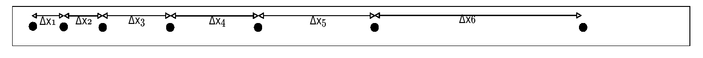

# EJERCICIO EXAMEN 3

### Indicaciones:

Lea atentamente el problema y responda las preguntas. Su examen consta de solo este ejercicio, así que por favor responda y argumente cada una de las preguntas que se le hacen, así como de hacer observaciones si lo requiere. Esto hará parte de la calificación del examen. Debe subir a la encuesta el archivo **.ipynb** y el archivo **.py** que descargue de google colab.

Pueden reunirse y discutir en grupo la solución pero deben entregar exámenes individuales. Esto implica que no deben haber copias exactas en donde lo único que cambie es el nombre ya que el analisis y las respuestas no deben ser identicas.

Tambien tenga presente que **los gráficos deben estar debidamente formateados y bien presentables.** Esto significa colocar lineas con puntos, grid, titulo, etiqueta de los ejes, leyenda del grafico \(sobretodo si hay mas de una curva en un solo gráfico\)

### 

### Ajustes de datos experimentales

En este problema se va a emplear el método de regresión lineal simple para hacer el ajuste de unos datos obtenidos en una practica de laboratorio. Para consultar sobre el método de regresión lineal simple, se les deja los siguientes enlaces:

* [Link 1](http://www.sc.ehu.es/sbweb/fisica/cinematica/regresion/regresion.htm)
* [Link 2](http://www.fisicarecreativa.com/taller/guias/cap5_cuadrados_minimos_v1.pdf)
* [Link 3](http://plasmalab.aero.upm.es/~practicasfisica/LabFisicaII-Files/Ayudas/MC/MinimosCuadrados.pdf)

Se tiene las medidas del desplazamiento de un objeto que se suelta del reposo, el cual tiene una cinta blanca de papel atada en un extremo. Esta cinta se hace pasar por un marcador que deja puntos cada cierto intervalo de tiempo: 



En la siguiente[ tabla de datos](https://drive.google.com/file/d/1bVnLM7wOPt6oiDUYCtmCBD5Dqnym-RZi/view), se muestran los valore de $$\Delta x$$ o la separación entre punto y punto \(Recuerde que estos datos son desplazamientos, no posiciones \). Cada punto fue marcado cuando $$t = i \Delta t$$ donde $$ i=1,2,..,N$$ \(Los datos de la primera columna de la tabla corresponden a los valores de $$i $$ \) y $$\Delta t=0.025s$$:

```text
#=============================================
# Datos experimentales:
# Dt = 0.025 s
# 
# i      DX(mm)
#=============================================
0        0
1        3
2        9
3        15
4        21
5        27
6        34
7        38
8        44
9        50
10       57
11       64
12       70
13       74
14       80
15       86
16       95
17       98
18       100
```

Basado en los datos anteriores, hacer lo siguiente:

**a\) Cargar archivo de datos usando numpy**

Debe guardar los datos anteriores en un archivo de texto \(o descargarlo directamente del link "tabla de datos" dejado arriba\).  Para cargar los datos, debe hacer uso de la librería numpy \(consultar que función debe usar\). Si hace uso de google colab, debe seguir las siguientes recomendaciones para poder usar el archivo de texto:


Una vez tenga el archivo de texto cargado en el colab, debe leerlo haciendo uso de numpy

**b\) Graficar la posición versus el tiempo**

Una vez haya cargado los datos, debe graficar la posición versus el tiempo. Tenga presente que en el archivo de texto, la columna 1 corresponde al indice $$i$$ y la columna 2 corresponde al desplazamiento. Con estos datos debe primero determinar el tiempo y la posición \(la distancia de los puntos respecto al punto inicial en la Figura 1\) para poder graficar, ya que la posición es distinto a desplazamiento. **Recomendacion:** note que los valores del desplazamiento están en milímetros; conviertalos a metros.

**c\) Obtener y graficar la velocidad versus el tiempo**

Para obtener la velocidad, debe tener en cuenta su [definición](http://laplace.us.es/wiki/index.php/Cinem%C3%A1tica_del_movimiento_rectil%C3%ADneo_%28GIE%29) \(consultar los conceptos de cinemática\):

$$
\overline{v}_y = \dfrac{y_2-y_1}{t_2-t_1} = \dfrac{\Delta y}{\Delta t}
$$

En este caso particular, la velocidad para cada $$\Delta t$$, viene dado por:

$$
\overline{v}_y(t_{i+1}) = \dfrac{y_{i+1}-y_i}{t_{i+1}-t_i}, \; i=0,1,2,...,N
$$

Tenga presente que la velocidad inicial es cero,  y note que para la velocidad se obtuvieron $$N$$ datos calculados con la anterior fórmula.  Para verificar, determine cuantos valores hay de $$y$$y cuantos valores hay de $$v_y.$$Note que el cero en la velocidad no esta incluido. Puede hacer uso de la funcion [np.insert](https://stackoverflow.com/questions/21761256/insert-element-into-numpy-array) para incluir el 0 al inicio del array de la velocidad

Una vez tenga estos valores, grafique la velocidad versus el tiempo. ¿Que tipo de gráfico obtiene?, ¿que forma cree que tiene la curva velocidad versus tiempo?. **Recomendación:** puede hacer uso de ciclos para resolver este problema, pero piense como se podría resolver usando las ventajas del _slicing_. Esto reduce el numero de lineas y la complejidad el código. 

**d\) Hacer un ajuste lineal a los datos de velocidad versus tiempo.**

En esta parte va hacer uso de ajuste lineal por mínimos cuadrados para determinar la linea que mas se ajusta a los puntos. Esto le permite obtener, a partir de unos datos experimentales la forma matemática que la describe. Esta forma matemática le permitirá hacer predicciones sobre la velocidad.

La idea de hacer un ajuste lineal por mínimos cuadrados, es obtener los parámetros $$a$$ y $$b$$ de la ecuación de la recta: $$y(x) = ax+b$$. En este caso particular, ¿ a que variable del problema corresponde $$x$$ y a que variable corresponde $$y$$?.

De acuerdo con la literatura, los valores de $$a$$ y $$b$$  se obtienen de las siguientes expresiones \(consultar links de arriba\):

$$
a = \dfrac{N \sum\limits_{i=1}^{N} x_iy_i - \sum\limits_{i=1}^{N} x_i \sum\limits_{i=1}^{N} y_i}{N\sum\limits_{i=1}^{N}x_i^2 - \left(\sum\limits_{i=1}^{N}x_i\right)^2}
$$

$$
b = \dfrac{\sum\limits_{i=1}^{N} x_i^2 \sum\limits_{i=1}^{N}y_i - \sum\limits_{i=1}^{N} x_i \sum\limits_{i=1}^{N} x_iy_i}{N\sum\limits_{i=1}^{N}x_i^2 - \left(\sum\limits_{i=1}^{N}x_i\right)^2}
$$

Existe el parámetro $$R^2$$ que permite determinar que tan bueno es el ajuste lineal. Para calcular este [parámetro de correlación](https://es.wikipedia.org/wiki/Coeficiente_de_determinaci%C3%B3n), se hace uso de la siguiente fórmula:

$$
R^2 = \dfrac{S_{xy}^2}{S_x^2S_y^2}
$$

donde $$ S_{xy}  = \dfrac{1}{N}\sum\limits_{i=1}^{N}(x_i-\bar{x})(y_i-\bar{y})$$ , $$S_x^2 = \dfrac{1}{N}\sum\limits_{i=1}^{N}(x_i-\bar{x})^2$$ , $$S_y^2 = \dfrac{1}{N}\sum\limits_{i=1}^{N}(y_i-\bar{y})^2$$, $$\bar{x}\; \text{y}\;\bar{y}$$ es el promedio de los valores de $$x$$ y $$y$$ respectivamente.

Con base a las anteriores formulas y los datos obtenidos en el punto anterior, obtenga los parámetros de la recta que ajusta mejor a los puntos de la curva velocidad versus tiempo. Que puede decir del valor de $$R^2$$. ¿Que tan bueno fue el ajuste?

**e\) Hacer un gráfico de la velocidad versus tiempo junto con la linea de ajuste lineal.**

Con los datos obtenidos del punto c y los parámetros del punto anterior, graficar nuevamente la curva velocidad versus tiempo junto con la linea de ajuste, la cual corresponde a una función lineal con los parámetros $$a$$ y $$b$$ . ¿ Que significado tiene el parámetro $$a$$?, ¿ qué significado tiene el parámetro $$b$$?. De acuerdo con las preguntas anteriores, ¿que puede decir del valor de $$a$$ obtenido en el punto anterior?. 

**d\) Hacer el gráfico aceleración versus tiempo**

Con los datos del punto c, calcular los valores de la aceleración. Tenga en cuenta que el numero de aceleraciones va a ser menor en un dato a los valores de la velocidad. Esto es, hay $$N+1$$valores de $$y$$ \(con $$i=0,1,...,N$$\), $$N$$ , valores de $$v_y$$ \(con $$i=1,...,N$$\) y $$N-1$$valores de aceleración \(con $$i=2,3,...,N$$\), Por ejemplo, si N=10, entonces habrán 10 posiciones, 9 velocidades y 8 aceleraciones, a menos que haya usado la funcion _np.insert_. En este caso, la velocidad y posición tendrían la misma cantidad de datos, pero la aceleración tendría una unidad menor en su longitud. Todo eso se debe a que cuando calcula velocidad y aceleración promedio, lo calcula por intervalos. Esto es, si usted tiene una recta, con una raya en cada extremo, y hace una raya en la mitad, tendría tres rayas en total, pero dos pedazos o segmentos de la recta.

Con los datos de la aceleración, haga uso de las funciones de numpy para calcular la media y la mediana. ¿ Que puede decir de la gráfica?, ¿qué puede decir los valores de la media y la mediana con respecto al valor de $$a$$ del numeral $$d$$?


